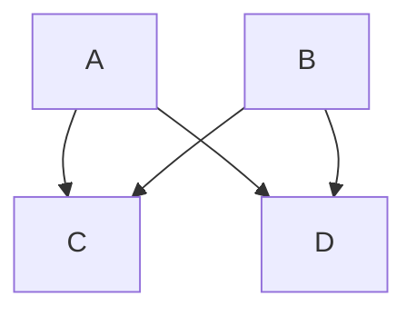

Building on the principles discussed in my previous [post](),
[post](), and [post]()
I started the [Faster-than-light](https://github.com/benthomasson/faster-than-light) project.   The goals of
this project are to explore new ways of using automation content and to explore how to scale up automation to
hundreds of thousands of managed nodes.

This project does not rely on other automation tools such as Ansible, SaltStack, or Puppet to accomplish its goals.
It is a library to build other methods of automation.   It is licensed under the permissive MIT open source license.

This project uses [zipapps](https://docs.python.org/3/library/zipapp.html) instead of the
[Ansiballz](https://docs.ansible.com/ansible/latest/dev_guide/developing_program_flow_modules.html#ansiballz-framework)
framework as discussed in this [post]().

Since remote host automation is inherently an I/O bound problem the framework is based on asyncio and uses
[asyncssh](https://asyncssh.readthedocs.io/en/latest/index.html)
for communication with remote hosts.  This reduces the memory footprint to one process and allows for
as many remote host connections as are supported by your operating system.

Faster-than-light is compatible with automation modules that run locally or remotely.  There is no support
for more complex automation workflows.  Those are left as exercises for projects using this library.

Keeping with the faster-than-light theme, the project uses FTL-gates to send
modules to the remote hosts and execute them.  An FTL-gate is a zipapp with a
small main program designed to manage the module while it is running. FTL-gates
can be built ahead of runtime with all the modules that are needed for an
automation run.  The FTL-gate is then sent over ssh to the remote host where it
starts running waiting for input.  Faster-than-light can then run any number of
modules any number of times just by sending the name of the module and the JSON
parameters for that module while the ssh connection is established.  This
cuts down on the time that is need to make zipapps from `O(n*m)` where n is the number
hosts and m is the number of tasks to `O(1)`.

FTL-gates are cached in `~/.ftl/` and hashed so that subsequent runs of a module
to not require the building of the FTL-gate.

The faster-than-light project does not provide automation modules itself.  There
are plently of open source automation modules that can be used with this library.
Faster-than-light just needs the file location of the modules to use them.
Downloading the modules is sufficent.

The [ftl-module-utils](https://github.com/benthomasson/ftl_module_utils)
project is a sister project that provides the module dependencies for Ansible
modules.   This allows for modules to be run remotely without needed all of the
Ansible core source code in the zipapp.

Faster-than-light is currently an experimental project and not meant for production.

The [run_module](https://github.com/benthomasson/faster-than-light/blob/adfa23403c3e5c304ac3d6d66af73d34ec3e1dd5/python-asyncio/faster_than_light/faster_than_light/module.py#L108) function is the main entry point for running automation modules.

